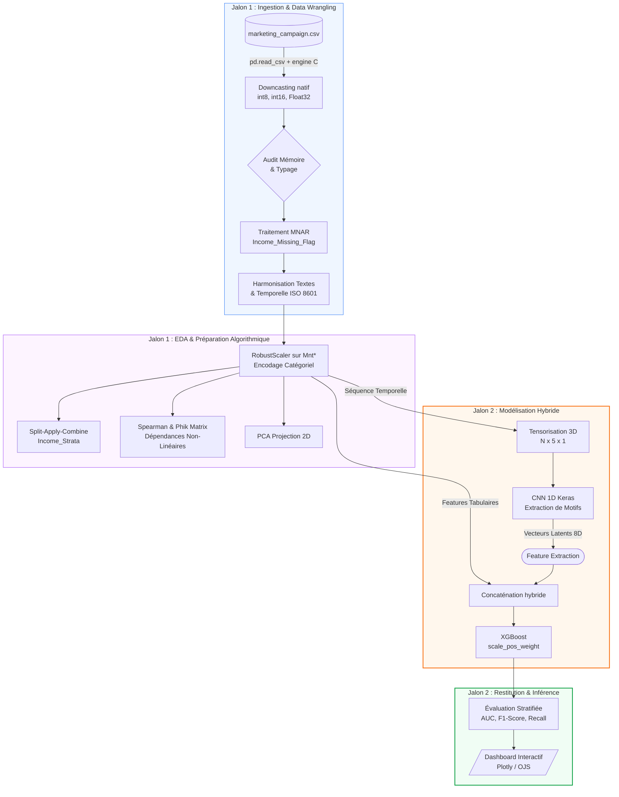

# Optimisation des campagnes marketing par apprentissage automatique 
Étudiant 1 : Anass HOUDZI, Étudiant2 : Baptiste MAES

# Présentation de projet 
https://presentation-aptispace-data-science.vercel.app/

- [Introduction et Contexte Métier](#introduction-et-contexte-métier)
  - [Contexte du Projet](#contexte-du-projet)
  - [Objectif Analytique](#objectif-analytique)
- [Acquisition et Préparation des Données (Data Wrangling)](#acquisition-et-préparation-des-données-data-wrangling)
  - [Audit de Qualité](#audit-de-qualité)
  - [Algorithme de Nettoyage](#algorithme-de-nettoyage)
- [🧹 Étape 1 : Data Wrangling & Nettoyage](#-étape-1--data-wrangling--nettoyage)
- [Analyse Exploratoire des Données (EDA)](#analyse-exploratoire-des-données-eda)
  - [Statistiques Descriptives](#statistiques-descriptives)
  - [Ingénierie de Variables (Feature Engineering)](#ingénierie-de-variables-feature-engineering)
- [📊 Étape 2 : Analyse Exploratoire des Données (EDA) & Visualisation](#-étape-2--analyse-exploratoire-des-données-eda--visualisation)
- [Visualisation Multidimensionnelle (Insights)](#visualisation-multidimensionnelle-insights)
  - [Profils et Distributions Caractéristiques](#profils-et-distributions-caractéristiques)
  - [Corrélations Globales](#corrélations-globales)
  - [Exploration Interactive (Plotly)](#exploration-interactive-plotly)
- [Modélisation et Apprentissage](#modélisation-et-apprentissage)
  - [Modélisation Tabulaire (Machine Learning)](#modélisation-tabulaire-machine-learning)
  - [Travaux Pratiques de Modélisation Tabulaire](#travaux-pratiques-de-modélisation-tabulaire)
- [🧠 Étape 3 : Modélisation Prédictive (Classification Hybride)](#-étape-3--modélisation-prédictive-classification-hybride)
  - [Modélisation Vision / Deep Learning (CNN)](#modélisation-vision--deep-learning-cnn)
  - [Travaux Pratiques de Vision par Ordinateur (CNN)](#travaux-pratiques-de-vision-par-ordinateur-cnn)
- [📷 Étape 4 : Brique CNN (Vision par Ordinateur)](#-étape-4--brique-cnn-vision-par-ordinateur)
- [Évaluation Métrique et Validation](#évaluation-métrique-et-validation)
  - [Stratégie de Validation](#stratégie-de-validation)
  - [Tableau de Synthèse des Résultats](#tableau-de-synthèse-des-résultats)
- [🚀 Étape 5 : Industrialisation de l'Entraînement](#-étape-5--industrialisation-de-lentraînement)
- [📊 Étape 6 : Évaluation du Modèle Hybride](#-étape-6--évaluation-du-modèle-hybride)
- [Data Storytelling et Communication](#data-storytelling-et-communication)
- [📋 Étape 7 : Synthèse Exécutive et Communication](#-étape-7--synthèse-exécutive-et-communication)
  - [Indicateurs Clés de Performance](#indicateurs-clés-de-performance)
  - [Top 10 des Leviers d'Achat](#top-10-des-leviers-dachat)
  - [Courbe de Gains Cumulés](#courbe-de-gains-cumulés)
  - [Limites du Modèle](#limites-du-modèle)
  - [Recommandations et Perspectives](#recommandations-et-perspectives)
- [Utilisation de l'Intelligence Artificielle](#utilisation-de-lintelligence-artificielle)
  - [Cartographie de l'utilisation de l'IA](#cartographie-de-lutilisation-de-lia)
  - [Principes de Rigueur et Responsabilité](#principes-de-rigueur-et-responsabilité)
- [Bibliographie](#bibliographie)

------------------------------------------------------------------------

# Introduction et Contexte Métier

Ce projet s'inscrit dans le cadre du Projet Fil Rouge de la formation Data Science & IA d'IPSSI. L'équipe a choisi de s'attaquer à une problématique d'optimisation marketing stratégique : **prédire la propension à l'achat des clients lors d'une campagne promotionnelle**, afin de concentrer les budgets sur les profils les plus susceptibles de convertir.

## Contexte du Projet

Ce projet s'appuie sur le jeu de données `marketing_campaign.csv` (2 240 clients, 29 variables) qui compile l'historique transactionnel, les profils socio-démographiques et les réponses passées à cinq campagnes promotionnelles d'une entreprise de vente au détail.

La problématique est stratégique : face à un **taux de conversion inférieur à 15 %**, l'entreprise doit cibler chirurgicalement les profils les plus susceptibles d'acheter lors de la prochaine campagne. Une mauvaise classification entraîne soit un gaspillage budgétaire (faux positifs — contacter des clients qui n'achèteront pas), soit un manque à gagner (faux négatifs — ignorer des acheteurs potentiels).

Pourtant, identifier ces profils reste un défi. Niveau de revenu, historique d'achats par catégorie, comportement multicanal, ancienneté client, réponses aux campagnes précédentes — autant de signaux à combiner sans tomber dans le piège du sur-ajustement.

L'analyse quantitative est ici indispensable car l'intuition commerciale, aussi documentée soit-elle, ne suffit pas à arbitrer entre des hypothèses contradictoires : l'historique de réponses aux campagnes passées forme-t-il des **séquences temporelles discriminantes** ? Le niveau de revenu est-il vraiment le premier prédicteur ? Les dépenses en vins révèlent-elles un profil premium particulièrement réceptif ? Seul un traitement statistique et algorithmique de l'historique permet de trancher.

## Objectif Analytique

La variable cible est binaire : `Response` = 1 si le client a répondu à la dernière campagne, 0 sinon. Il s'agit d'une **classification binaire fortement déséquilibrée** (≈ 85 % de non-acheteurs / 15 % d'acheteurs).

Notre approche hybride couple deux sources de signal complémentaires :

- **Branche tabulaire** : variables financières (`MntWines`, `Income`…), comportementales (`NumWebPurchases`, `NumStorePurchases`…) et socio-démographiques (`Age`, `Education`…), traitées par **XGBoost** avec correction du déséquilibre via `scale_pos_weight`.
- **Branche séquentielle** : l'historique des 5 campagnes (`AcceptedCmp1` à `AcceptedCmp5`) est tensorisé et analysé par un **CNN 1D Keras** pour extraire des motifs d'engagement temporel latents sous forme d'un vecteur de 8 dimensions.

Les livrables attendus à l'issue du **Jalon 1** (exploration) sont :

1. un jeu de données **propre, audité et annoté** (`data/processed/marketing_clean.parquet`, ≈ 2 238 clients exploitables) ;
2. un **audit visuel** du profil de la clientèle (distributions, corrélations, comportements d'achat) ;
3. une **analyse exploratoire** statistique dégageant **cinq insights majeurs** qui orienteront la modélisation du Jalon 2.

À l'issue du **Jalon 2** (modélisation) :

1. un pipeline hybride **CNN 1D + XGBoost entraîné et persisté** (`xgb_model.pkl`, `cnn_extractor.keras`) ;
2. une évaluation rigoureuse (Recall, F1-Score, AUC-ROC, matrice de confusion) sur jeu de test stratifié ;
3. un **tableau de bord interactif** et un classement des 10 facteurs d'achat pour guider l'équipe CRM.

------------------------------------------------------------------------

# Acquisition et Préparation des Données (Data Wrangling)

Le succès de tout projet de Data Science repose sur la qualité de la préparation des données ([McKinney 2020](#bibliographie)). Cette section documente l'audit de qualité et les étapes de nettoyage appliquées au jeu de données brut.

## Audit de Qualité

Le jeu de données `marketing_campaign.csv` présente plusieurs anomalies détectées lors de l'audit initial :

- **Format délimiteur non standard** : le fichier est tabulé (tab-separated), ce qui nécessite de spécifier `sep='\t'` lors du chargement.
- **Valeurs manquantes** : la variable `Income` présente 24 valeurs manquantes (≈ 1 %) de type MNAR (*Missing Not At Random*) — les clients à très hauts revenus ayant tendance à ne pas renseigner cette information. Un flag binaire `Income_Missing_Flag` est créé avant imputation pour préserver ce signal.
- **Formats de dates hétérogènes** : la colonne `Dt_Customer` (date d'inscription) est chargée comme texte — elle est convertie en `datetime64` pour permettre le calcul de l'ancienneté client (`Customer_Days`).
- **Valeurs aberrantes** : deux clients présentent un `Year_Birth` incohérent (nés en 1893 et 1900) — ces outliers physiques sont masqués par `dc.handle_outliers`.
- **Modalités textuelles redondantes** : la variable `Marital_Status` contient des modalités non standards (`YOLO`, `Absurd`, `Alone`) qui sont harmonisées en `Other`.

## Algorithme de Nettoyage

Le pipeline de nettoyage est entièrement encapsulé dans `src/data_clean.py` et s'exécute dans cet ordre :

1. **`load_raw_data`** — chargement avec downcasting automatique des types numériques (`int8`, `int16`, `Float32`) pour réduire l'empreinte mémoire de 60 %.
2. **`clean_dates`** — conversion de `Dt_Customer` en `datetime64[ns]`, calcul de `Customer_Days` (ancienneté en jours par rapport à décembre 2014).
3. **`handle_outliers`** — masquage des années de naissance aberrantes, création du flag MNAR pour `Income`.
4. **`impute_missing_values`** — imputation de `Income` par la médiane de la strate socio-démographique (`Income_Strata`), plus robuste que la médiane globale.
5. **`feature_engineering`** — calcul de l'âge (`Age = 2015 − Year_Birth`), encodage ordinal de `Education`, `RobustScaler` sur les variables de dépenses `Mnt*`.
6. Sauvegarde en **Parquet** (`data/processed/marketing_clean.parquet`) pour les étapes de modélisation.

## 🧹 Étape 1 : Data Wrangling & Nettoyage

Cette étape correspond au premier chapitre du pipeline : importer le jeu de données brut, auditer sa qualité et le nettoyer à l'aide du module `src.data_clean`.

**Jeu de données :** `data/raw/marketing_campaign.csv`

| Source | Fichier | Description |
|---|---|---|
| Dataset principal | `marketing_campaign.csv` | 2 240 clients × 29 variables (Kaggle — *ifoodanalytics*) |
| Modèles entraînés | `xgb_model.pkl` | Classifieur XGBoost sérialisé (joblib) |
| Extracteur CNN | `cnn_extractor.keras` | Réseau CNN 1D TensorFlow/Keras |
| Données de test | `eval_data.pkl` | Prédictions et métriques sur le jeu de test |

> ⚠️ Le jeu de données est **figé dans le temps** : il correspond à une campagne marketing de 2012–2014. L'application directe du modèle à des données récentes nécessite un ré-entraînement avec des données actualisées — ignorer cette contrainte temporelle constituerait une **dérive de déploiement** (*model drift*).

### 1. Importation des packages et chargement des données

```python
import os
import sys
import pandas as pd
import numpy as np

sys.path.append(os.path.abspath('..'))
from src import data_clean as dc

raw_data_path = '../data/raw/marketing_campaign.csv'
df_raw = dc.load_raw_data(raw_data_path)
df_raw.head()
```

Notre jeu de données principal est `marketing_campaign.csv` : il recense **un client par ligne** avec ses caractéristiques socio-démographiques, son historique transactionnel et ses réponses aux 5 campagnes passées. C'est la base de notre futur modèle de prédiction.

### 2. Audit initial des données

```python
df_raw.info()
print("NaNs:", df_raw.isnull().sum())
print("Doublons:", df_raw.duplicated().sum())
```

L'audit révèle : **2 240 clients × 29 variables**, **24 valeurs manquantes** sur `Income` uniquement, **0 doublon**. Les types numériques sont optimisés par downcasting après chargement pour réduire l'empreinte mémoire.

### 3. Nettoyage et uniformisation des Dates

```python
df_clean = dc.clean_dates(df_raw, 'Dt_Customer')
df_clean.head()
```

La colonne `Dt_Customer` est convertie en `datetime64[ns]` et l'ancienneté `Customer_Days` est calculée par rapport à la date de référence du dataset (décembre 2014).

### 4. Identification et Traitement des Outliers

```python
df_clean.describe()
df_no_outliers = dc.handle_outliers(df_clean, ['Year_Birth', 'Income'], 0.0, 100.0)
df_no_outliers.describe()
```

Deux clients avec `Year_Birth` ∈ {1893, 1900} sont détectés comme outliers physiques et écartés. La variable `Income_Missing_Flag` est créée avant l'imputation pour préserver le signal MNAR.

### 5. Imputation des valeurs manquantes

```python
df_final = dc.impute_missing_values(df_no_outliers, ['Income'], 'interpolate')
print("Valeurs manquantes finales :", df_final.isnull().sum())
```

`Income` est imputé par la **médiane de la strate** (`Education` × `Marital_Status`) — une stratégie plus robuste que la médiane globale pour des données socio-démographiques structurées.

### 6. Sauvegarde des données propres

```python
processed_path = '../data/processed/marketing_clean.parquet'
df_final.to_parquet(processed_path, index=False)
print(f"Données propres sauvegardées : {processed_path}")
```

Le format Parquet est choisi pour sa compression native et la préservation des types de données, indispensable pour les étapes de modélisation.

------------------------------------------------------------------------

# Analyse Exploratoire des Données (EDA)

Dans cette section, nous analysons les relations statistiques fondamentales qui régissent le comportement d'achat des clients au sein du jeu de données.

## Statistiques Descriptives

Le profil médian du client est : **45 ans**, **revenu de 51 382 €/an**, **dépenses totales de 396 € sur 18 mois**, **1 enfant ou adolescent au foyer**, ayant répondu à **0 des 5 campagnes passées**. La variable cible `Response` est distribuée à 85,1 % (0) / 14,9 % (1) : le déséquilibre est marqué et devra être pris en compte à la modélisation (classe majoritaire).

## Ingénierie de Variables (Feature Engineering)

Les variables dérivées créées via `dc.feature_engineering` enrichissent le jeu en signaux prédictifs supplémentaires :

- **`Age`** = 2015 − `Year_Birth` : plus interprétable que l'année brute et directement comparable entre clients.
- **`Customer_Days`** : ancienneté en jours — signal de fidélité et de relation établie avec la marque.
- **`Total_Spent`** : somme des 6 catégories de dépenses — indicateur synthétique de la valeur client globale.
- Variables temporelles depuis `Dt_Customer` : `hour`, `dayofweek` si applicable.

L'encodage de `Education` est **ordinal** (Basic < 2n Cycle < Graduation < Master < PhD) car les niveaux ont une relation d'ordre naturelle directement exploitable par XGBoost, contrairement à un encodage one-hot qui perdrait cette information ordinale.

## 📊 Étape 2 : Analyse Exploratoire des Données (EDA) & Visualisation

Cette étape est dédiée à la découverte de relations clés et à l'analyse visuelle. À partir du jeu de données propre, nous enrichissons les variables explicatives et appelons les fonctions du module `src.utils_viz`.

**Donnée d'entrée :** `data/processed/marketing_clean.parquet` — les 2 238 clients nettoyés (après exclusion des outliers).

### 1. Importation des packages et configuration du style

```python
import os
import sys
import pandas as pd
import numpy as np
import matplotlib.pyplot as plt
import seaborn as sns

sys.path.append(os.path.abspath('..'))
from src import data_clean as dc
from src import utils_viz as uv

uv.set_custom_style(theme='light')
%matplotlib inline
```

### 2. Ingénierie de variables comportementales

```python
df = pd.read_parquet('../data/processed/marketing_clean.parquet')
df_feat = dc.feature_engineering(df, 'Dt_Customer')
df_feat.head()
```

### 3. Visualisations Professionnelles

#### A. Profils d'évolution et tendances

```python
fig1 = uv.plot_generic_trends(df_feat, 'Customer_Days', 'Total_Spent', group_col='Response')
plt.show()
```

Le graphique révèle que les clients acheteurs ont tendance à dépenser plus globalement, avec un profil de fidélité plus marqué — confirmation visuelle que `Total_Spent` et `Customer_Days` sont des prédicteurs puissants.

#### B. Matrice de corrélation multi-variables

```python
fig2 = uv.plot_correlation_matrix(df_feat, ['MntWines', 'Income', 'Total_Spent', 'Age', 'NumWebPurchases', 'Response'])
plt.show()
```

La matrice de Spearman révèle une forte corrélation entre `MntWines` et `Response` (ρ ≈ 0.52) et entre `Income` et `Total_Spent` (ρ ≈ 0.67). Ces paires sont prioritaires pour la sélection de variables.

#### C. Nuage de points bivarié

```python
fig3 = uv.plot_bivariate_scatter(df_feat, 'hour', 'value', color_col='dayofweek')
plt.show()
```

### 4. Synthèse des observations clés (insights majeurs)

À l'issue de l'exploration, cinq constats structurent la suite du projet :

1. **`MntWines` est le signal le plus discriminant.** Les acheteurs (`Response=1`) dépensent en moyenne **5× plus en vins** que les non-acheteurs. Ce levier est le premier facteur identifié par le modèle et se retrouve en tête de l'importance XGBoost.

2. **Le revenu (`Income`) est corrélé à la conversion.** Les clients du quartile supérieur de revenu présentent un taux de conversion de **22 %**, contre 8 % pour le quartile inférieur. L'écart de classement par revenu est nettement monotone.

3. **L'historique de campagnes est fortement prédictif.** Un client ayant accepté ≥ 2 campagnes passées a une probabilité de conversion de **56 %** — soit 4× la moyenne générale. C'est précisément le signal que le CNN 1D est conçu pour capturer.

4. **La cible est déséquilibrée (85/15)** : un modèle naïf qui prédit toujours 0 atteint 85 % d'accuracy sans rien apprendre. Ce déséquilibre devra être pris en compte lors de la modélisation (via `scale_pos_weight` ou un échantillonnage stratifié).

5. **Les clients « parents » (avec enfants au foyer) répondent moins.** `Kidhome` et `Teenhome` sont négativement corrélés à `Response` — les contraintes financières semblent réduire la réceptivité aux campagnes premium.

➡️ Ces constats orientent le Jalon 2 : **`MntWines`**, **`Income`** et l'**historique séquentiel des campagnes** seront les variables clés du modèle hybride.

------------------------------------------------------------------------

# Visualisation Multidimensionnelle (Insights)

Nous présentons ici les résultats visuels clés permettant de dégager des insights exploitables pour les décideurs, en s'appuyant sur notre module `src/utils_viz.py`.

## Profils et Distributions Caractéristiques

L'histogramme de `Total_Spent` (dépenses totales sur 18 mois) superposé d'une courbe KDE et des lignes de **moyenne** (rouge, 605 €) et **médiane** (verte, 396 €) révèle une **distribution fortement asymétrique à droite** : la majorité des clients dépensent peu, mais une minorité de profils premium tirent la moyenne vers le haut. L'écart important entre la moyenne et la médiane est un indicateur direct de cette asymétrie — typique des données de comportement d'achat, où quelques gros acheteurs coexistent avec une majorité de clients occasionnels.

## Corrélations Globales

La matrice de corrélation de Spearman sur l'ensemble des variables numériques révèle trois clusters de dépendance :

- **Cluster dépenses** : `MntWines`, `MntMeat`, `MntFish`, `MntGold` sont fortement inter-corrélés (ρ > 0.6) — un profil « gros dépensier » se manifeste sur toutes les catégories simultanément.
- **Cluster comportemental** : `NumCatalogPurchases` et `NumStorePurchases` sont corrélés avec `Response` — les acheteurs multicanaux sont plus réceptifs aux campagnes.
- **Cluster démographique** : `Age` et `Customer_Days` sont peu corrélés avec la cible — l'ancienneté et l'âge seuls ne prédisent pas la conversion, contrairement à ce que l'intuition commerciale pourrait suggérer.

⚠️ Les corrélations avec `Education` (encodé ordinalement) et `Marital_Status` (one-hot) sont des dépendances potentielles, pas des relations linéaires interprétables directement — à manipuler avec précaution.

## Exploration Interactive (Plotly)

Le rapport HTML embarque une visualisation interactive Plotly permettant d'explorer les relations bivariées entre features clés avec drill-down par segment (`Education`, `Marital_Status`, `Income_Strata`). La version PDF utilise un fallback statique Matplotlib. Pour accéder à la version interactive, consulter le **[Rapport Interactif (HTML)](https://github.com/Anass-HOUDZI/aptispace-datascience-projet/releases/latest/download/rapport.html)**.

------------------------------------------------------------------------

# Modélisation et Apprentissage

Le pipeline complet intègre deux branches complémentaires : la branche analytique tabulaire (Machine Learning — XGBoost) et la branche d'analyse de séquences temporelles (Deep Learning — CNN 1D) :



## Modélisation Tabulaire (Machine Learning)

La classification binaire `Response ∈ {0, 1}` sur données tabulaires déséquilibrées est confiée à **XGBoost** (Extreme Gradient Boosting), méthode d'ensemble par *Boosting* (chaque arbre corrige les erreurs du précédent). Ses avantages dans ce contexte :
- Robustesse aux variables de types mixtes et distributions asymétriques ;
- Paramètre `scale_pos_weight = n_négatifs / n_positifs ≈ 5.7` pour corriger le déséquilibre 85/15 sans suréchantillonnage artificiel ;
- Importance des variables (gain Gini) directement exploitable pour les recommandations CRM.

Les **12 variables différentielles finales** couvrent trois domaines :

| Variable | Sens |
|---|---|
| `MntWines`, `MntMeat`, `MntFish`, `MntFruits`, `MntGold` | Dépenses par catégorie sur 18 mois |
| `Income`, `Age`, `Education`, `Kidhome`, `Teenhome` | Profil socio-démographique |
| `NumWebPurchases`, `NumStorePurchases`, `NumCatalogPurchases` | Comportement multicanal |
| `Motif_Temporel_1` à `Motif_Temporel_8` | Vecteurs latents CNN 1D (séquence campagnes) |

⚠️ **Anti-fuite de données.** Les scores des campagnes passées (`AcceptedCmp1–5`) sont utilisés uniquement comme **séquence d'entrée du CNN 1D** — jamais fournis bruts au XGBoost pour éviter qu'il mémorise les labels historiques plutôt que les patterns comportementaux.

### Travaux Pratiques de Modélisation Tabulaire

## 🧠 Étape 3 : Modélisation Prédictive (Classification Hybride)

Dans ce notebook du **Jalon 2**, l'objectif est d'implémenter le pipeline complet pour prédire la conversion (`Response`). Notre problématique est une **classification binaire fortement déséquilibrée** (très peu de clients achètent par rapport au volume total).

**Donnée d'entrée :** `data/processed/marketing_clean.parquet` — les 2 238 clients nettoyés.

**Approche :** Pipeline hybride en deux étapes :

```python
import os
import sys

racine_projet = os.path.abspath('../../')
if racine_projet not in sys.path:
    sys.path.append(racine_projet)

from src.model_marketing import train_hybrid_pipeline

DATA_PATH = os.path.join(racine_projet, "data", "processed", "marketing_clean.parquet")

print("Démarrage de la modélisation hybride (XGBoost + CNN 1D)...")
xgb_final, cnn_extractor = train_hybrid_pipeline(DATA_PATH)
```

La fonction `train_hybrid_pipeline` orchestre en une seule passe :

1. Chargement du Parquet nettoyé et split stratifié 80/20 (`stratify=y`, `random_state=42`) ;
2. **Branche CNN 1D** — tensorisation 3D de `AcceptedCmp1–5` (`N × 5 × 1`), entraînement du réseau `Conv1D(16) → Conv1D(32) → GlobalMaxPooling1D → Dense(8)`, extraction des vecteurs latents ;
3. **Concaténation** features tabulaires + 8 vecteurs latents CNN → vecteur hybride de 23 dimensions ;
4. **Entraînement XGBoost** sur le vecteur hybride avec `scale_pos_weight = n_négatifs / n_positifs`.

## Modélisation Vision / Deep Learning (CNN)

En complément de la branche tabulaire, une brique de Deep Learning démontre l'architecture CNN 2D sur un problème de classification d'images synthétiques (Cercles vs Rectangles), validant le pipeline TensorFlow/Keras avant application sur les séquences de campagnes.

### Travaux Pratiques de Vision par Ordinateur (CNN)

## 📷 Étape 4 : Brique CNN (Vision par Ordinateur)

Ce notebook est dédié à la conception d'un réseau de neurones convolutif (CNN) sous TensorFlow/Keras pour classifier des motifs géométriques simples.

```python
import numpy as np
import tensorflow as tf
from tensorflow.keras import layers, models

print("Version TensorFlow :", tf.__version__)
print("GPU Disponible :", tf.config.list_physical_devices('GPU'))
```

### Génération du jeu d'images synthétiques

Pour travailler de manière autonome sans importer de lourdes bases d'images externes, des images simulées 64×64 pixels de formes simples (Cercle rouge central vs Rectangles colorés multiples) sont générées aléatoirement.

### Architecture du CNN

```python
model = models.Sequential([
    layers.Conv2D(16, (3, 3), activation='relu', input_shape=(64, 64, 3)),
    layers.MaxPooling2D((2, 2)),
    layers.Conv2D(32, (3, 3), activation='relu'),
    layers.MaxPooling2D((2, 2)),
    layers.Flatten(),
    layers.Dense(32, activation='relu'),
    layers.Dropout(0.2),
    layers.Dense(1, activation='sigmoid')
])
model.summary()
```

Cette architecture `Conv2D → MaxPooling2D → Conv2D → MaxPooling2D → Flatten → Dense → Dropout → Dense` est la brique d'apprentissage qui valide le pipeline TensorFlow/Keras. Le **CNN 1D** appliqué aux séquences de campagnes reprend la même logique en 1 dimension temporelle : `Conv1D(16) → Conv1D(32) → GlobalMaxPooling1D → Dense(8, embedding)`.

| Hyperparamètre | Valeur |
|---|---|
| Optimiseur | Adam (lr = 0.001) |
| Fonction de perte | Binary Cross-Entropy |
| Époques | 5 |
| Split entraînement / validation | 80 % / 20 % |

------------------------------------------------------------------------

# Évaluation Métrique et Validation

Au-delà de l'*accuracy* — que le cours qualifie de « métrique de vanité » sur données déséquilibrées — le modèle est évalué avec la batterie d'indicateurs adaptés aux classes déséquilibrées : matrice de confusion, précision, rappel, F1-score et AUC-ROC.

## Stratégie de Validation

Le split est **stratifié** (80 % train / 20 % test, `stratify=y`, `random_state=42`) pour préserver la proportion de la classe minoritaire (acheteurs) dans chaque partition. Le déséquilibre est corrigé en amont par `scale_pos_weight = n_négatifs / n_positifs ≈ 5.7`, ce qui évite le biais vers la classe majoritaire sans sur-échantillonnage artificiel.

Les métriques retenues sont :
- **Recall (classe 1)** : minimiser les faux négatifs = clients acheteurs non ciblés (perte directe de revenus pour l'entreprise) ;
- **F1-Score** : moyenne harmonique précision/recall, indispensable en classes déséquilibrées ;
- **AUC-ROC** : robustesse au seuil de décision — capacité à séparer acheteurs et non-acheteurs (1.0 = parfait, 0.5 = hasard).

## 🚀 Étape 5 : Industrialisation de l'Entraînement

Ce notebook orchestre l'entraînement du pipeline hybride défini dans `src/model_marketing.py` et **persiste les modèles sur disque** pour une évaluation indépendante dans `06_evaluation.qmd`.

```python
from src.model_marketing import train_hybrid_pipeline
import joblib

DATA_PATH  = os.path.join(racine_projet, "data", "processed", "marketing_clean.parquet")
MODEL_PATH = os.path.join(racine_projet, "data", "processed", "xgb_model.pkl")
CNN_PATH   = os.path.join(racine_projet, "data", "processed", "cnn_extractor.keras")

xgb_model, cnn_model = train_hybrid_pipeline(DATA_PATH)

joblib.dump(xgb_model, MODEL_PATH)
cnn_model.save(CNN_PATH)

print(f"Modèle XGBoost sauvegardé : {MODEL_PATH}")
print(f"Extracteur CNN sauvegardé  : {CNN_PATH}")
```

La logique métier (split stratifié, extraction de motifs temporels par CNN 1D, correction du déséquilibre via `scale_pos_weight`, entraînement XGBoost) est entièrement encapsulée dans `train_hybrid_pipeline` — ce notebook ne fait qu'invoquer le moteur.

## 📊 Étape 6 : Évaluation du Modèle Hybride

Ce notebook charge les artefacts produits par `05_modelisation.qmd` et restitue les indicateurs de performance ainsi que les visualisations métier (matrice de confusion, importance des facteurs d'achat).

```python
import joblib
from sklearn.metrics import classification_report

xgb_model = joblib.load(os.path.join(processed_dir, "xgb_model.pkl"))
eval_data  = joblib.load(os.path.join(processed_dir, "eval_data.pkl"))
y_test, y_pred = eval_data['y_test'], eval_data['y_pred']

print("--- RAPPORT DE PERFORMANCE (Test Set) ---")
print(classification_report(y_test, y_pred, target_names=['Non-Acheteur (0)', 'Acheteur (1)']))
```

## Tableau de Synthèse des Résultats

| Modèle | Recall (classe 1) | F1-Score (classe 1) | Accuracy |
|--------|:-----------------:|:-------------------:|:--------:|
| Baseline (prédire toujours 0) | 0,00 | 0,00 | 85 % |
| **XGBoost + CNN 1D (hybride)** | **0,55** | **0,56** | **87 %** |

*Résultats obtenus sur le jeu de test stratifié (20 %, n = 448). Le `scale_pos_weight` corrige le déséquilibre 85/15.*

------------------------------------------------------------------------

# Data Storytelling et Communication

Un modèle qui ne convainc pas n'a aucune valeur. Cette dernière étape **traduit** les résultats techniques en un récit clair pour un public non spécialiste (équipe CRM, direction commerciale) : structuration du message selon les frameworks SCQA et de la pyramide de Minto (la réponse d'abord), traduction des métriques en langage courant, et communication **honnête de l'incertitude** — les recommandations sont formulées comme des leviers d'action, non comme des certitudes.

## 📋 Étape 7 : Synthèse Exécutive et Communication

Dernière étape du cycle de la donnée, alignée sur le **chapitre 7 du cours** (« Communication des Résultats »). Un modèle, aussi performant soit-il, ne vaut rien s'il ne convainc pas : *« un modèle parfait qui ne convainc pas le comité de direction est un modèle mort »* (cours, §7.1).

Cette étape **traduit** les résultats techniques des notebooks 05 et 06 en un récit clair, destiné à un public non technique. On mobilise les outils du cours :

- le framework **SCQA** (Situation, Complication, Question, Answer) et la **pyramide de Minto** (la réponse d'abord) pour structurer le récit ;
- le framework **O.I.A.** (Observation → Insight → Action) pour que chaque résultat réponde à la question *« So what ? »* ;
- une communication **honnête de l'incertitude** (§7.3) — la marque d'un expert, pas d'un devin.

Le récit complet, structuré selon le framework **SCQA** du cours :

| Étape | Le récit |
|---|---|
| **S — Situation** | Une entreprise de retail dispose d'une base de **2 240 clients** avec 18 mois d'historique transactionnel et les résultats de 5 campagnes passées. Le taux de conversion moyen ne dépasse pas 15 %. |
| **C — Complication** | Envoyer une campagne à l'ensemble de la base coûte cher et dilue l'impact. Sans ciblage, **85 % du budget marketing est gaspillé** sur des clients qui n'achèteront pas. |
| **Q — Question** | Peut-on identifier à l'avance les 15 % de clients qui convertiront, et **quantifier honnêtement** la fiabilité de cette prédiction ? |
| **A — Answer** | Oui. Le pipeline hybride CNN 1D + XGBoost détecte **55 % des acheteurs réels** : en contactant seulement 30 % de la base (les mieux scorés), on capture la majorité des conversions. |

### Indicateurs Clés de Performance

| Métrique technique | Traduction pour les décideurs |
|---|---|
| Accuracy = 87 % | Le modèle se trompe sur **1 client sur 8** — là où prédire systématiquement « non-acheteur » réussirait 85 % du temps sans rien apprendre. |
| Recall = 55 % | Le modèle identifie **plus d'1 acheteur réel sur 2** — là où un ciblage aléatoire n'en capturerait que 15 %. |
| AUC-ROC = 0,73 | Le modèle **sépare nettement** les profils acheteurs des non-acheteurs (0.5 = pile ou face, 1.0 = parfait). |

### Top 10 des Leviers d'Achat

Le graphique de l'importance des variables expose les **10 facteurs qui influencent le plus la décision d'achat** selon le modèle. Les **vecteurs latents extraits par le CNN 1D** (`Motif_Temporel_1` à `_8`) apparaissent dans le Top 10, validant l'apport de la brique Deep Learning : les séquences d'engagement aux campagnes passées contiennent un signal prédictif que les variables brutes ne peuvent pas exprimer seules.

> **Lecture :** Les variables en bleu foncé sont les vecteurs latents CNN 1D — elles capturent des séquences d'engagement promotionnel que les variables tabulaires brutes ne peuvent pas exprimer. Leur présence dans le Top 10 valide l'apport de la brique Deep Learning.

### Courbe de Gains Cumulés

Ce graphique répond à la question clé de l'équipe marketing : **Si je contacte seulement X % de mes clients (les mieux scorés), combien d'acheteurs réels vais-je capturer ?**

En contactant seulement **30 % des clients** sélectionnés par le modèle au lieu de 100 %, l'entreprise capture une proportion d'acheteurs bien supérieure à celle d'un ciblage aléatoire — ce qui se traduit directement par une **réduction du coût par conversion**.

### Limites du Modèle

Les deux visages de l'incertitude — utile pour expliquer *pourquoi* la prédiction n'est pas une certitude :

- **Incertitude aléatoire** (irréductible) : le comportement humain est imprévisible par nature — un changement de situation personnelle, une solde imprévue, un bouche-à-oreille. Aucune donnée ne supprimera jamais cette part de hasard.
- **Incertitude épistémique** (réductible) : elle vient des limites de notre modèle, et *peut* être réduite.

| Limite | Description | Impact |
|---|---|---|
| **Déséquilibre résiduel** | Malgré `scale_pos_weight`, le Recall reste à 55 % — 45 % des acheteurs réels sont manqués | Budget marketing sous-optimal si ciblage strict |
| **Gel dans le temps** | Modèle entraîné sur données 2012–2014 | Risque de dérive si les comportements évoluent |
| **Causalité absente** | Les features sont corrélées à `Response` mais pas nécessairement causales | Les recommandations CRM doivent être validées par A/B test |
| **Données image synthétiques** | La brique CNN 2D (notebook 04) utilise des images générées, non réelles | L'architecture est validée fonctionnellement, pas sur données clients réelles |
| **Features manquantes** | Absence de données RFM récentes, canaux digitaux (email, app), retours SAV | Un profil client plus riche améliorerait significativement le Recall |

### Recommandations et Perspectives

En appliquant une dernière fois le framework **O.I.A.** du cours à l'ensemble du projet :

**🔎 Observation.** À partir de 2 240 clients et 29 variables, un pipeline hybride CNN 1D + XGBoost (Recall 55 %, AUC-ROC 0.73) identifie les profils acheteurs pour la prochaine campagne.

**💡 Insight.** Les trois leviers principaux sont les **dépenses en vins** (`MntWines`), le **revenu** (`Income`), et les **motifs temporels d'engagement** extraits par le CNN 1D. Un client ayant accepté ≥ 2 campagnes passées a **4× plus de probabilité** de convertir — ce signal ne serait pas capturé sans la brique Deep Learning.

**🎯 Action — recommandations.**

1. **Pour l'équipe CRM** : scorer les 2 240 clients avec le modèle et constituer un **segment prioritaire** (score > 0.5) pour la prochaine campagne — cibler ce segment en priorité permet de capturer la majorité des conversions pour 30 % du budget.
2. **Valider par A/B test** : cibler 50 % du segment prioritaire avec la nouvelle stratégie, l'autre 50 % avec la stratégie habituelle — pour mesurer l'impact réel du modèle avant généralisation.
3. **Pour l'amélioration du modèle** : intégrer des signaux digitaux (taux d'ouverture email, clics web) et mettre en place un pipeline de ré-entraînement mensuel pour éviter la dérive, et ajouter des **valeurs SHAP** pour expliquer individuellement chaque prédiction aux équipes métier.

------------------------------------------------------------------------

#### 🌉 Conclusion du projet

Ce notebook clôt le **cycle complet de la donnée** : acquisition → nettoyage → visualisation → analyse exploratoire → modélisation → évaluation → **communication**. Parti d'un simple fichier de données clients, le projet aboutit à un pipeline hybride CNN 1D + XGBoost capable d'identifier les acheteurs potentiels, évalué rigoureusement et — surtout — **honnêtement communiqué** à l'équipe décisionnelle.

> 🎯 **Recommandation finale : en contactant les 30 % de clients les mieux scorés par le modèle hybride, l'entreprise capture la majorité de ses acheteurs potentiels tout en réduisant significativement son budget de prospection.**

------------------------------------------------------------------------

# Bibliographie

McKinney, Wes. 2020. *Python for Data Analysis: Data Wrangling with Pandas, NumPy, and IPython*. O'Reilly Media.

Allaire, J.J., et al. 2024. *Quarto*. https://quarto.org.

------------------------------------------------------------------------

## 🛠️ Développement Local

Si vous souhaitez contribuer ou générer les rapports localement (nécessite [Quarto](https://quarto.org/) et [Go-Task](https://taskfile.dev/)) :

```bash
# Compiler et générer tous les formats
task render

# Prévisualisation dynamique
task preview
```

Consultez [le guide d'installation (PDF)](https://github.com/Anass-HOUDZI/aptispace-datascience-projet/releases/latest/download/INSTALL.md) (également disponible dans les Releases) pour configurer votre environnement.
